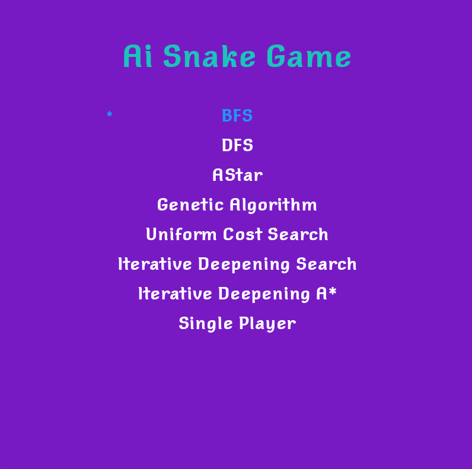
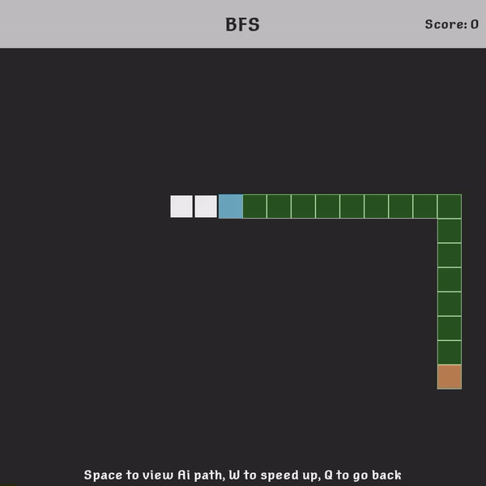
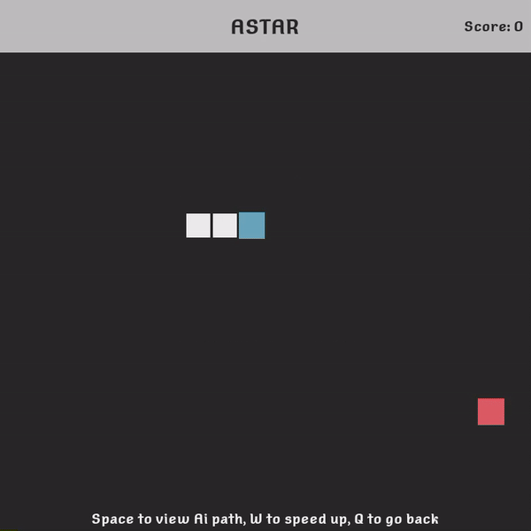
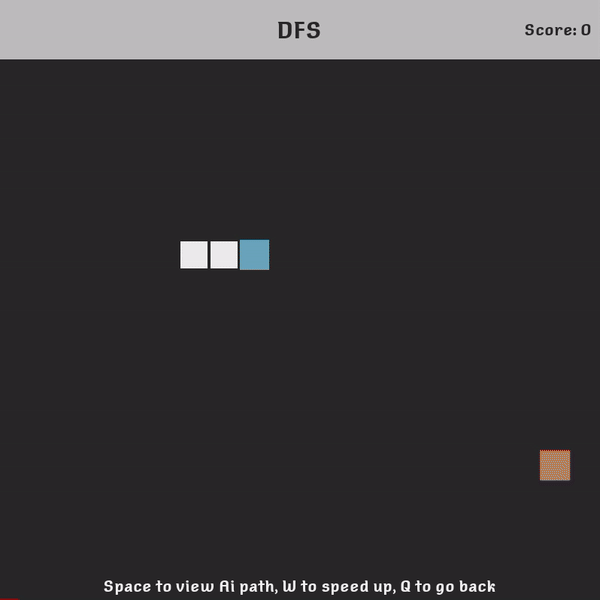

# Snake AI
> This project is a fork of [NinaM31/Snake-ai](https://github.com/NinaM31/Snake-ai) with some algorithms added and an improved UI.

This game demonstrates various pathfinding algorithms and a genetic algorithm using neural networks to control a snake in a grid environment. It includes implementations of BFS, DFS, A*, IDS, IDAStar, and UCS algorithms.
This game also includes a single player mode

# Requirements

 To run this game you have to install:

- pygame==2.0.1
- numpy

> To start the game run Main.py

## GIFs

  
  
  
  

